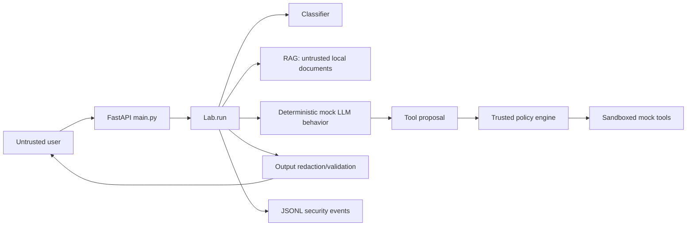

# Architecture walkthrough

1. `app.main.chat` validates HTTP shape and creates `ChatRequest`.
2. `Lab.run` creates a correlation ID, classifies input, and calls `rag.retrieve`.
3. The prompt boundary combines content only in the deliberately vulnerable simulation. Basic detection may block direct input. Hardened logic labels retrieved material untrusted and never treats it as authority.
4. `_proposal` represents attacker-influenceable model output. `PolicyEngine.decide` is the trusted, deterministic authorization boundary.
5. Only allowed proposals reach `tools.execute`; every side effect is a local simulation. High-risk actions require an explicit approval flag.
6. Hardened responses pass through redaction. Decisions are appended as correlated structured events.

The modes intentionally share the pipeline so the attack input is comparable. Vulnerable mode executes proposals without policy. Basic mode adds input detection and policy checks but has weaker document isolation. Hardened mode combines isolation, deny-by-default authorization, approval, output redaction, and logging.
